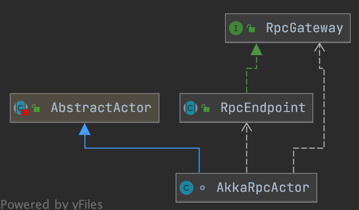

# AkkaRpcActor类分析

## 作用
Akka rpc actor which receives LocalRpcInvocation, RunAsync and CallAsync ControlMessages messages.

The LocalRpcInvocation designates a rpc and is dispatched to the given RpcEndpoint instance.

The RunAsync and CallAsync messages contain executable code which is executed in the context of the actor thread.

The **ControlMessages message** controls the processing behaviour of the akka rpc actor. A ControlMessages#START  starts processing incoming messages. A  ControlMessages#STOP message stops processing messages. All messages which arrive when the processing is stopped, will be discarded.

## AkkaRpcActor和AkkaRpcService的关系
AkkaRpcService是一个服务。
AkkaRpcActor是一个拥有完全RPC行为的独立个体。AkkaRpcActor需要AkkaRpcService的支撑（AkkaRpcService是AkkaRpcActor的子类）

## AkkaRpcActor和AkkaEndPoint的关系
AkkaRpcActor是AkkaEndPoint的子类，拥有比AkkaEndPoint更丰富的功能


## 处理RPC消息
三种消息类型的处理方式：
```java
protected void handleRpcMessage(Object message) {
    if (message instanceof RunAsync) {
        handleRunAsync((RunAsync) message);
    } else if (message instanceof CallAsync) {
        handleCallAsync((CallAsync) message);
    } else if (message instanceof RpcInvocation) {
        handleRpcInvocation((RpcInvocation) message);
    }
}
```

### 第一种：
核心代码：
```java
private void handleRunAsync(RunAsync runAsync){
        runAsync.getRunnable().run();
}
```
只是在actor线程中简单的执行Runnable
### 第二种：
核心代码：注意Callable有返回值（Runnable没有）
```java
private void handleCallAsync(CallAsync callAsync) {
        try {
            Object result = callAsync.getCallable().call(); // 有返回值
            getSender().tell(new Status.Success(result), getSelf());
        } catch (Throwable e) {
            getSender().tell(new Status.Failure(e), getSelf());
        }
    }
```

第三种：
通过在RPC endpoint上寻找RPC方法并用提供的参数执行该方法，来处理RPC请求。
Handle rpc invocations by looking up the rpc method on the rpc endpoint and calling this
method with the provided method arguments. If the method has a return value, it is returned
to the sender of the call.
```java
private void handleRpcInvocation(RpcInvocation rpcInvocation) {
        Method rpcMethod = null;

        try {
            String methodName = rpcInvocation.getMethodName(); // 1. 反射：获取方法名
            Class<?>[] parameterTypes = rpcInvocation.getParameterTypes(); // 2. 获取方法的参数类型

            rpcMethod = lookupRpcMethod(methodName, parameterTypes); // 3.在本地找RPC方法名
        } catch (Exception e) {
            ....// 异常处理
            
        }

        if (rpcMethod != null) {
            try {
                // this supports declaration of anonymous classes
                rpcMethod.setAccessible(true);

                if (rpcMethod.getReturnType().equals(Void.TYPE)) {
                    // No return value to send back
                    rpcMethod.invoke(rpcEndpoint, rpcInvocation.getArgs()); // 4. 获得参数值，在rpcEndpoint端调用方法
                } else {
                    final Object result;
                    try {
                        result = rpcMethod.invoke(rpcEndpoint, rpcInvocation.getArgs());
                    } catch (InvocationTargetException e) {
                    }

                    final String methodName = rpcMethod.getName();

                    if (result instanceof CompletableFuture) {
                        final CompletableFuture<?> responseFuture = (CompletableFuture<?>) result;
                        sendAsyncResponse(responseFuture, methodName); // 异步发送调用结果
                    } else {
                        sendSyncResponse(result, methodName); // 同步发送调用结果
                    }
                }
            } catch (Throwable e) {
                getSender().tell(new Status.Failure(e), getSelf());
            }
        }
    }
```
其中：如何查找RPC方法：所调用的地方（rpcEndpoint类）所定义的方法
```java
private Method lookupRpcMethod(final String methodName, final Class<?>[] parameterTypes)
            throws NoSuchMethodException {
        return rpcEndpoint.getClass().getMethod(methodName, parameterTypes);
    }
```

### 三种调用的区别
* Runnable调用：只是把传入的message简单执行下（比如说这个runnable里就一句say hello）
* Callable调用：只是把传入的message简单执行下
* handleRpcInvocation调用：真正需要进行远程过程调用的。


### RpcInvocation类型
#### RemoteRpcInvocation 远程调用
* 有序列化操作
内部类，MethodInvocation

#### LocalRpcInvocation 本地调用
* 没有序列化操作


# 本章Java知识 TODO
反射的原理：在运行时，获取Method，Field，Constructor等
动态代理的原理：动态代理是反射的重要应用。是在运行时才知道接口的具体实现类是啥。不管运行时底层实际是什么类在执行，都可以用一个Proxy来代表这个实际执行的类。
关键方法的实现


